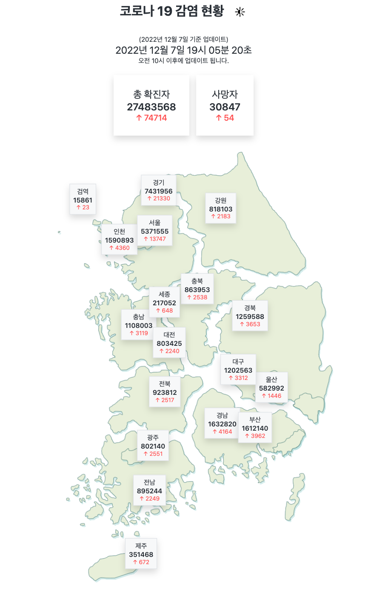

# COVID19 DATA PROJECT

## 시작일

2021년 7월

## 리팩토링월

2022년 4월

## 사용 기술

## 리팩토링 변경사항 및 주요 기능

- bootstrap 라이브러리 기능 삭제
- api key 비공개 처리
- ui 편의상 그래프 삭제
- css 파일 분리
- 화면 크기에 따라 조정(권장 max-width:1200px)
- 모바일환경 가능
- 다크모드 설정
- 코로나 공공 open api 통신

## Screenshot

## Link

-[배포링크](http://covid19-page.s3-website.ap-northeast-2.amazonaws.com/)
